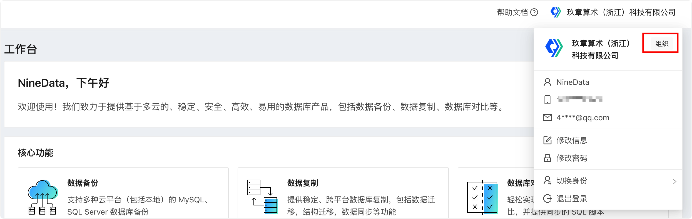
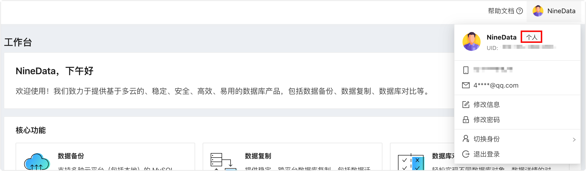

# 账户管理简介

NineData 提供企业多人协作能力，在创建或加入组织后，即可开启该能力。本文介绍组织、用户、角色等多个概念。

### 组织

通常情况下，您在[注册 NineData 账号](../quick_start/1_registration.md)之后，默认为**个人模式**，此时，您可以无障碍使用 NineData 提供的四大模块功能（[SQL 窗口](/sqldev/sql_console.md)、[备份与恢复](/backup_and_restore/intro_back.md)、[数据复制](/replication/intro_repli.md)、[数据库对比](/compare/intro_comp.md)），个人模式适用于个人开发者，例如对自身的数据库进行备份恢复、同步、对比，以及配合 SQL 窗口进行日常开发等工作。

然而对于企业用户，存在多人协同开发的需求，在该场景下，有多种角色分别负责不同的业务，因此每种角色需要不同的权限以满足数据安全的需要。NineData 提供的**组织模式**支持对组织下的每个用户分配不同的角色和资源管理权限，适用于同一组织下多用户协同开发，在保证数据安全的同时，提升整体生产效率。

您可以将鼠标放置于页面右上角的图标处，查看当前所处的模式。

如何管理组织，请参见[管理组织](manage_organization.md)。

### 用户

用户是 NineData 中独立的个体，在个人模式下，用户即您自身，拥有资源的所有权限。而在组织模式下，用户是组成一个组织的一部分，由系统管理员决定该用户是什么角色，并分配相应的资源权限。

您可以将鼠标放置于页面右上角的图标处，查看当前所处的模式。

关于用户的更多信息，请参见[管理用户](manage_user.md)。

### 角色

角色决定了用户对于资源的使用权限，NineData 提供了如下 5 个预置角色：

- 系统管理员：创建组织的用户默认为系统管理员，拥有组织内数据源的所有权限；拥有组织内用户、角色的管理权限；<!--拥有查看审计日志（用户行为记录）的权限；-->拥有所有功能模块权限。
- 生产环境管理员：默认拥有生产环境数据源和功能模块的所有权限。
- 生产环境只读：默认拥有生产环境数据源的只读权限，以及所有功能模块权限。
- 开发环境管理员：默认拥有开发环境数据源和功能模块的所有权限。
- 普通成员：拥有所有功能模块权限。

:::tip

- 系统管理员可以删除、编辑除**系统管理员**以外的所有预置角色，并且可以新增自定义角色。更多信息，请参见[管理角色](manage_role.md)。
- 各预置角色对应的详细权限，请参见[附录：预置角色权限列表](manage_role.md#附录预置角色权限列表)。

:::

### 权限

NineData 中的权限分为四大类：

- **管理权限**：管理当前组织中的用户以及角色。仅**系统管理员**拥有**管理权限**。

- **模块权限**：决定用户是否可以看到控制台左侧的 **SQL 开发**、**备份与恢复**、**数据复制**、**数据库对比**、**数据源管理**五大模块，粒度细分到各模块中的子功能入口，例如 **SQL 开发**中的 **SQL 窗口**。

- **数据源权限**：决定用户是否可以对目标数据源发起编辑、SQL 查询或更改、备份恢复、数据复制、数据库对比等操作。

  :::tip

  **数据源权限**需要与**模块权限**配合使用，例如，用户对某个数据源拥有数据复制的权限，但是未被赋予数据复制的模块权限，则依然无法使用数据复制功能。

  :::

- **告警权限**：分为**管理告警**和**查看告警**两种。
  
  - **管理告警**：支持查看系统推送的告警信息；支持创建、编辑、禁用、删除告警策略。更多信息，请参见[管理告警](../alart/intro.md)。
  - **查看告警**：仅支持查看系统推送的告警信息。

### 附录：查看当前模式

### 相关文档

- [管理组织](manage_organization.md)
- [管理用户](manage_user.md)
- [管理角色](manage_role.md)
- [管理工单](manage_workflow.md)
