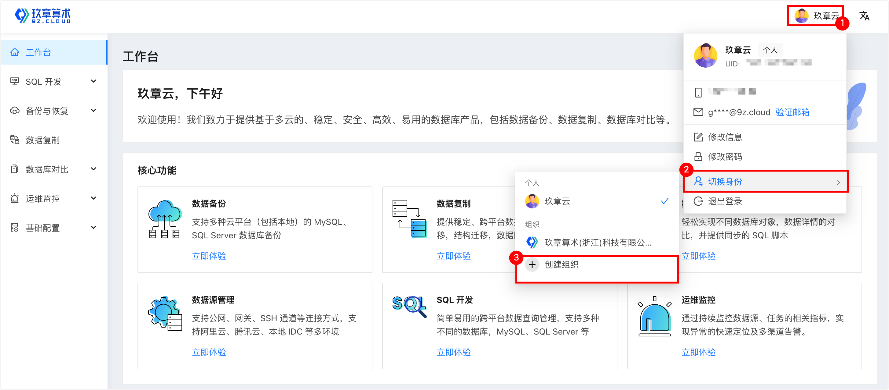
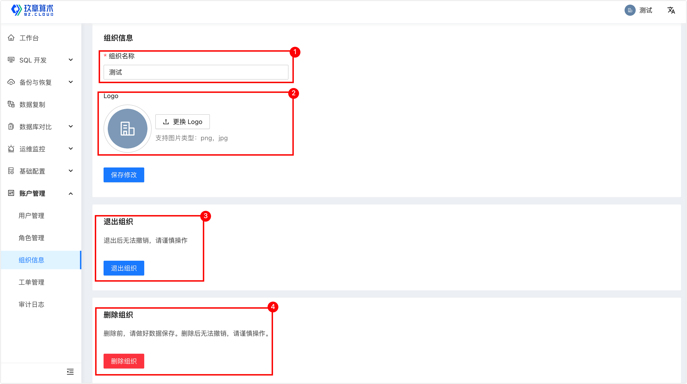

# 管理组织

对于企业用户，NineData 的个人模式无法满足业务需求，通过管理组织，可以有效进行多用户协同合作，通过角色来管理每个用户的权限。本文介绍如何管理组织。
### 创建组织

**前提条件**

已注册 NineData 账号。更多信息，请参见[注册 NineData 账号](../quick_start/1_registration.md)。

**操作步骤**

1. 登录 [NineData 控制台](https://console.ninedata.cloud)。

2. 在 NineData 控制台页面的右上角，将鼠标移动到用户头像上，单击**切换身份**>**创建组织**。

3. 在**创建组织**页面，根据下表配置参数。

   | 参数

 | 说明                                                         |
   | -------------------------------------- | ------------------------------------------------------------ |
   | **组织名称**                           | 输入组织的名称，为了便于辨认，通常使用企业名称。最多支持 24 个字符。 |
   | **邀请用户**（可选）                   | <ul><li>电子邮箱：输入您希望邀请加入组织的成员电子邮箱。</li><li>角色：选择对应用户加入到组织后的角色。</li><li>添加：增加一条用户邀请记录。您可以通过该功能批量邀请用户加入组织。</li></ul> **说明**：您也可以在组织创建完成后，再邀请用户。如何邀请用户，请参见[邀请用户](manage_user.md#邀请用户)。 |

4. 单击**确定**，即可完成组织的创建。
### 切换到组织

**前提条件**

已创建组织。更多信息，请参见[创建组织](#创建组织)。

**操作步骤**

1. 登录 [NineData 控制台](https://console.ninedata.cloud)。
2. 在 NineData 控制台页面的右上角，将鼠标移动到用户头像上，单击**切换身份**，在**组织**下选择创建完成的组织。
3. 此时已经从个人模式切换至组织模式，在左侧导航栏中单击**账户管理**，在这里，您可以进行账户相关的管理操作。

:::tip

仅系统管理员用户显示**用户管理**、**角色管理**以及**审计日志**等管理入口，其他角色用户无该权限。更多关于角色对应的权限信息，请参见[预置角色权限列表](manage_role.md#附录预置角色权限列表)。

:::

### 查看或编辑组织信息

**前提条件**

- 已[创建组织](#创建组织)并[切换到组织](#切换到组织)。
- 如需编辑组织信息，用户角色必须为**系统管理员**。

**操作步骤**

1. 登录 [NineData 控制台](https://console.ninedata.cloud)。

2. 在左侧导航栏，单击**账户管理**>**组织信息**，即可查看当前组织的信息。

3. 在**组织信息**页面，您可以进行如下操作。

   | 序号

 | 参数

 | 说明                                                         |
   | -------------------------------------- | -------------------------------------- | ------------------------------------------------------------ |
   | 1                                      | 修改组织名称（仅限系统管理员操作）     | 可以修改组织名称。最多支持 24 个字符。修改完成后需要单击**保存修改**。 |
   | 2                                      | 更换 Logo（仅限系统管理员操作）         | 单击**更换 Logo** 可以上传组织的 Logo。上传完成后需要单击**保存修改**。 |
   | 3                                      | **退出组织**                           | 退出当前组织。如果您是该组织中唯一的系统管理员，则需要先将系统管理员转移给组织中的其他成员，才能退出。 |
   | 4                                      | 删除组织（仅限系统管理员操作）         | 删除当前组织。 **警告**：删除后，组织中的所有数据源、成员等都会丢失，且删除组织操作无法撤销，请谨慎操作。 |

   

### 下一步

[管理用户](manage_user.md)