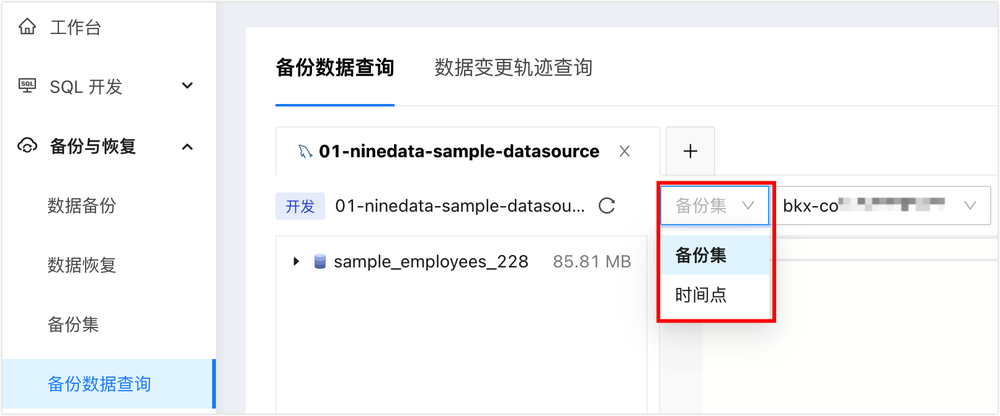

# 查询备份数据

基于自研的计算存储引擎，NineData 数据备份服务可实现任意时间点备份数据的快速查询。当业务库发生数据丢失时，可通过此功能快速完成数据的查询及恢复。

### 前提条件

已经完成一次完整的逻辑备份，更多信息，请参见[执行逻辑备份](backup/logical_backup.md)。

### 使用限制

- 当前不支持视图（VIEW）的查询。
- 当前仅支持从逻辑备份数据进行查询。

### 操作步骤

1. 登录 [NineData 控制台](https://console.ninedata.cloud)。

2. 在左侧导航栏单击**备份与恢复**>**备份数据查询**。

3. 在**备份数据查询**页签，根据下表进行配置，并单击**开始查询**。

   | 参数

 | 说明                                                         |
   | -------------------------------------- | ------------------------------------------------------------ |
   | **请选择源数据源**                     | 备份的对象，您可以通过选择数据源快速找到**备份集**。         |
   | **查询方式**                           | <ul><li>**全量备份集**：该方式基于全量备份数据，支持查询全量备份完成时间点前的所有数据，不包含增量数据。</li><li>**按时间点查询**：该方式基于全量备份数据和日志，可查询全量数据和后续产生的增量数据。具体可恢复时间段请参见控制台。</li></ul> |
   | **备份集**                             | **查询方式**为**全量备份集**时可配置，选择全量备份集。       |
   | **查询时间点**                         | **查询方式**为**按时间点查询**时可配置，选择查询哪个时间段的数据。<ul><li>逻辑备份：达到秒级 RPO，可查询备份开始至当前时间点前几秒之间的任意时间点的数据。</li><li>物理备份：分钟级 RPO，可查询备份开始至当前时间点前几分钟到 30 分钟之间的任意时间点的数据。</li></ul> |

4. 页面跳转至 SQL 窗口，您可以在这里通过查询语句查询备份数据中的内容。您可以单击**备份集**或**时间点**切换查询方式。

   :::tip
   
   - SQL 窗口的使用方法，请参见 [SQL 窗口](../sqldev/sql_console.md)。
   - 查询到需要的数据后，可以通过结果集中的**导出**功能，将数据导出并恢复到到目标数据库。
   
   :::

### 附录：支持的查询语法

当前支持

### 相关文档

- [数据备份简介](intro_back.md)
- [执行逻辑备份](backup/logical_backup.md)
- [执行物理备份](backup/physical_backup.md)
- [恢复逻辑备份数据](restore/restore_logical_backup.md)
- [恢复物理备份数据](restore/restore_physical_backup.md)
- [查看备份集](view_backup_sets.md)
