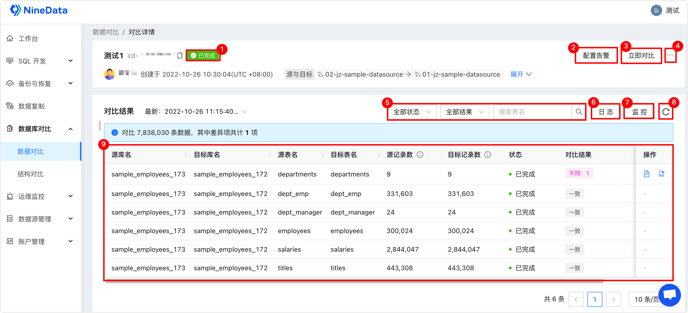

# 数据对比

NineData 数据库对比功能支持数据对比，即用户数据（UserData）的对比，用于对比两个数据库中的数据是否一致。通常用于备份恢复、数据迁移、数据同步后两端的数据一致性对比。本文介绍如何进行数据对比。

### 前提条件

- 已将需要进行对比的数据源添加到 NineData。更多信息，请参见[添加数据源](../configuration/datasource.md)。

- 源和目标数据源的类型和版本为下表中的其中之一。

  <table>
  <thead>
    <tr>
      <th width="400pt">源数据源</th>
      <th width="400pt">目标数据源</th>
    </tr>
  </thead>
  <tbody>
    <tr>
      <td rowspan="2">MySQL：8.0、5.7、5.6、5.5、5.1</td>
      <td>MySQL：8.0、5.7、5.6、5.5、5.1</td>
    </tr>
    <tr>
      <td>ClickHouse：19.4及以上</td>
    </tr>
    <tr>
      <td>SQL Server：2019、2017、2016、2014、2012、2008R2</td>
      <td>SQL Server：2019、2017、2016、2014、2012、2008R2</td>
    </tr>
  </tbody>
  </table>
  
  

### 操作步骤

1. 登录 [NineData 控制台](https://console.ninedata.cloud)。

2. 在左侧导航栏单击**数据库对比**>**数据对比**。

3. 在**数据对比**页面的右上角，单击**创建数据对比**。

4. 在**选择数据源**页签，按照下表进行配置，并单击**下一步**。

   | 参数

 | 说明                                                         |
   | -------------------------------------- | ------------------------------------------------------------ |
   | **任务名称**                           | 输入对比任务的名称，为了方便后续查找和管理，请尽量使用有意义的名称。最多支持 64 个字符。 |
   | **源数据源**                           | 对比任务的源数据源，系统将基于该数据源的结构进行对比。       |
   | **目标数据源**                         | 对比任务的对象数据源。                                       |
   | **对比频率**                           | 选择对比的执行频率。<ul><li>**一次性对比**：仅执行一次对比任务。你可以手动多次执行对比任务。</li><li>**周期性对比**：周期性地执行对比任务。</li></ul> |
   | **对比周期**（仅**周期性对比**显示）   | 选择多长时间对比一次，可选周一到周日的任意一天或多天，也可以勾选**每天**，每天备份一次。 |
   | **启动时间**（仅**周期性对比**显示）   | 选择每个对比周期日的几点启动对比任务，可选 **00:00~23:59**，您也可以单击**此刻**，选择当前的时间点作为启动时间。 |
   | **对比方式**                           | 选择数据的对比方式。<ul><li>**全量数据对比**：对所有选择的数据进行对比。</li><li>**快速对比**：依次进行如下对比。<ul><li>对比表中的总记录数。</li><li>查找表中所有<a class="tooltip tooltip-style2">数值类型不同数据库类型有不同的数值类型。 <ul><li>MySQL：BIT、TINYINT、BOOL、SMALLINT、MEDIUMINT、INT、BIGINT、DECIMAL、FLOAT、DOUBLE</li><li>SQLServer：BIGINT、NUMERIC、BIT、SMALLINT、DECIMAL、SMALLMONEY、INT、TINYINT、MONEY、FLOAT、REAL</li></ul></a>以及布尔（bool）类型的列，进行最大值、最小值以及平均值的对比。</li><li>每张表随机抽样 100 条记录（不足 100 条的取实际数量）进行对比。</li></ul></li></ul> |

5. 在**选择对比对象**页签，选择需要对比的内容，并单击**下一步**。支持**全实例**和**部分对象**。

   - **全实例**：选择源数据源中所有的数据库及对象。
   - **部分对象**：自定义选择需要进行对比的数据库及对象。在左侧**源对象**列表中，勾选需要对比的数据库及对象，单击**>**添加到**目标对象**列表。

6. 在**配置映射关系**页签，配置源端和目标端的数据库及对象名称的映射关系，并单击**保存并预检查**。

   :::tip

   目标端中的数据库及对象名称如果和源端中的不一致，则需要进行配置。单击数据表列表右侧的**映射与过滤**，可以配置目标字段名和源字段名的映射关系。

   <!--

   - 单击页面右上角的**表批量配置**，可以通过正则表达式的形式批量配置映射关系。
   - 单击页面右上角的**重置**，可以清除之前的配置。
   - 单击数据表列表右侧的**映射与过滤**，可以配置目标字段名和源字段名的映射关系。除此之外，您还可以使用过滤条件表达式设置**数据过滤条件**，例如 `CREATED_DATE>'2022-09-30 00:00:00'` 表示只对比 2022 年 09 月 30 日当天和之后的数据。您可以通过**搜索表名**功能快速定位到目标表。

   -->

   :::

7. 在**预检查**页签，等待系统完成预检查，预检查通过后，单击**启动任务**。

   :::tip

   - 如果预检查未通过，需要单击目标检查项右侧**操作**列的**详情**，排查失败的原因，手动修复后重新执行预检查，直到通过。
   - **检查结果**为**警告**的检查项，可视具体情况修复或忽略。

   :::

8. 在**启动任务**页面，提示**启动成功**。您可以执行如下操作：

   - 如果是**周期性对比**，可以单击**立即对比**，立即执行一次对比任务。
   - 单击**查看详情**查看对比任务的执行情况。
   - 单击**返回列表**可以返回**数据对比**列表。

 ### 查看对比结果

1. 登录 [NineData 控制台](https://console.ninedata.cloud)。

2. 在左侧导航栏单击**数据库对比**>**数据对比**。

3. 在**数据对比**页面单击目标同步任务的**任务 ID**，页面说明如下。

   
   
   | 序号

 | 功能

 | 介绍                                                         |
   | :------------------------------------: | -------------------------------------- | ------------------------------------------------------------ |
   |                   1                    | 任务状态                               | 对比任务的当前状态。                                         |
   |                   2                    | 配置告警                               | 配置告警后，系统会在任务失败时通过您选择的方式通知您。       |
   |                   3                    | 立即对比                               | 仅未进行中的任务显示，立即开始一次对比任务。                 |
   |                   4                    | 更多                                   | <ul><li>**暂停**：暂停任务，仅状态为**运行中**的任务可选。</li><li>**编辑**：对任务的配置信息进行编辑。</li><li>**终止**：结束任务。</li><li>**删除**：删除任务，任务删除后无法恢复，请谨慎操作。</li></ul> |
   |                   5                    | 筛选项目                               | 可以通过**任务状态**、**任务结果**、**表名称**快速筛选需要的对比结果。 |
   |                   6                    | 日志                                   | 记录对比任务执行过程中的所有日志，支持通过**日志类型**、**日志产生时间**、**关键字**等项目快速筛选定位到目标日志。 |
   |                   7                    | 监控                                   | 任务的监控信息，展示每秒的对比记录数。                       |
   |                   8                    | 刷新                                   | 获取对比任务的最新状态。                                     |
   |                   9                    | 对比结果列表                           | 展示源端和目标端之间的结构对比结果。<ul><li>在对比列表右侧**操作**列单击（不一致情况下显示)：查看源端和目标端的表定义 DDL 语句对比详情。</li><li>在对比列表右侧**操作**列单击（不一致情况下显示)：生成变更 SQL，您可以直接复制该 SQL 到目标数据源执行，修改不一致的内容。</li></ul> |

 

### 相关文档

- [数据库对比简介](intro_comp.md)

- [执行结构对比](structure_comparation.md)
