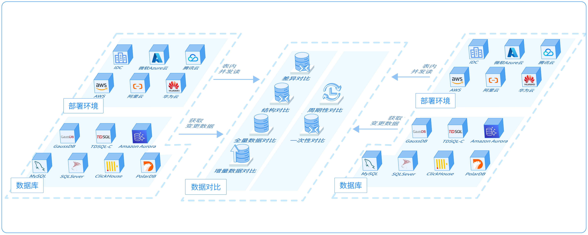

# 数据库对比简介

NineData数据库对比功能支持对两个数据源之间的内容进行一致性对比，不一致的情况下还支持自动生成变更SQL，您可以直接复制并在目标端执行，实现数据与结构的一致性。

### 功能介绍

* [结构对比](structure_comparation.md)：结构对比即元数据（MetaData）的对比，用于对比两个数据库中对象的定义是否一致。例如，对比两个表中的列（column）、索引（index），约束（主键、外键、constraint）等是否一致。
* [数据对比](data_comparation.md)：数据对比即用户数据（UserData）的对比，用于对比两个数据库中的数据是否一致。通常用于备份恢复、数据迁移、数据同步后两端的数据一致性对比。

### 产品架构

### 使用场景

| 场景                               | 说明                                                         |
| ---------------------------------- | ------------------------------------------------------------ |
| 跨部门、跨地域校验数据库架构一致性 | 企业用户在管理多项目或多模块的同类数据库时，由于组织或团队的分散或独立性，数据库结构和对象的变化没有及时同步到所有的数据中心或子项目，应用程序报错后才被发现。 **NineData数据结构对比**服务定期对比源端和目标端的元数据，保证整个所有数据库节点的数据结构一致性，并且提供修复建议，避免业务崩溃。 |
| 跨地域、跨云多活数据校验           | 为实现低延迟就近读写、数据库多活再被能力，企业通常会在不同地域或云平台之间搭建数据复制和同步。然而由于系统架构的局限性等多种因素影响，可能会出现数据不一致的情况，因此周期性的数据校验必不可少。而在数据量庞大的情况下，全量对比是比较昂贵低效的方法。 **NineData数据结构对比**服务基于**分组混检**和**快速哈希**，提供了高效的数据一致性检查，同时针对不一致的情况，提供SQL变更脚本，在目标端执行即可保证两端数据一致。 |
| ELT/ETL过程中数据的完整性          | 经典的ETL和云原生时代的ELT，都要求把多种数据源的数据导入到某个数据仓库中，用来支持OLAP和BI分析。 然而源端和目标端通常是异构的，数据聚合和架构转换过程中可能会影响数据的一致性。**NineData数据结构对比**服务支持同构、异构数据库之间的数据对比，很大程度上降低了在该过程中出现数据不一致的风险。 |

### 相关文档

- [执行数据对比](data_comparation.md)

- [执行结构对比](structure_comparation.md)
