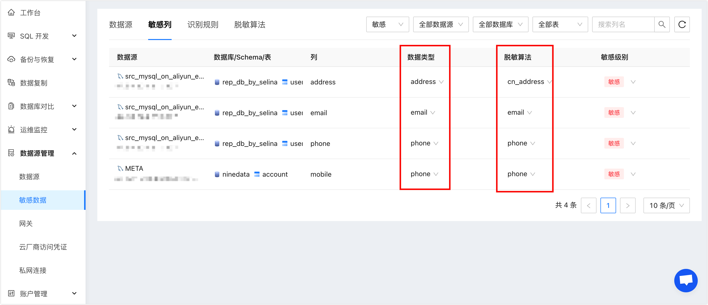

# 添加敏感数据

NineData支持对将数据源中的某一列或多个列设置为敏感列，未被授权查看敏感列的用户将无法查看该列的内容。

### 前提条件

已将需要添加敏感字段的数据源添加到NineData。如何添加，请参见[添加数据源](datasource.md)。

### 为数据源添加敏感列

1. 登录[NineData控制台](https://console.9z.cloud)。

2. 在左侧导航栏单击**基础配置**>**敏感数据**。

3. 在**数据源**页签，单击页面右上角的**添加数据源**。

4. 单击**数据源**下方的选框，会弹出已添加到NineData的数据源列表，从列表中选择需要添加敏感列的数据源。

   :::tip

   如果您没有找到目标数据源，请单击列表下方的**立即创建**，添加数据源。更多信息，请参见[添加数据源](datasource.md)。

   :::

5. NineData支持**手动添加**和**扫描添加**两个选项，其中**扫描添加**可以根据[识别规则](#rules)自动扫描数据源中的敏感列并添加到敏感列列表。

   - **手动添加**：单击**手动添加**，在右侧的**添加敏感列**页面中勾选需要添加为敏感列的列名，并单击**确认**。

   :::tip

   如果数据库中内容太多不方便查找，您可以在**添加敏感列**页面上方选择数据库和数据表，过滤出目标表，然后通过列名搜索，可以快速定位到目标列。

   :::

   - **扫描添加**：单击**扫描添加**，在右侧的**扫描添加**页面中单击**开始扫描**，等待扫描完成后，在**敏感列**列表中勾选扫描出的敏感列，并单击**确认**。

6. 敏感列列表中显示的即是您在上一步中选择的列，你需要为每个列选择**数据类型**和**脱敏算法**。

   :::tip

   所有添加到敏感列中的列，其**敏感级别**默认为**敏感**，如果调整**敏感级别**为**普通**，则相当于单击右侧**操作**列的**移除**，该列将不再是敏感列。

   :::

7. 单击**添加数据源**完成敏感列的添加。

### 管理敏感列

1. 登录[NineData控制台](https://console.9z.cloud)。

2. 在左侧导航栏单击**基础配置**>**敏感数据**。

3. 单击**敏感列**页签，这里会列出当前NineData账号下所有数据源中的敏感列，您可以做如下操作：

   - 查看：查看当前NineData账号下所有敏感列。
   - 修改敏感列的**数据类型**和**脱敏算法**。
   - 修改敏感列的**敏感级别**：**敏感级别**修改为**普通**后，该列将自动从**敏感列**列表移除。

   :::tip
   
   如果敏感列太多不方便查找，您可以在页面右上方通过筛选数据源、数据库、数据表、列名，快速定位到目标敏感列。
   
   :::

### 创建识别规则

识别规则用于系统自动扫描数据源中的敏感列，NineData提供了10条默认的[识别规则](#rules)，这些规则无法被修改。您也可以根据如下步骤创建自定义识别规则。

1. 登录[NineData控制台](https://console.9z.cloud)。

2. 在左侧导航栏单击**基础配置**>**敏感数据**。

3. 单击**识别规则**页签，并在页面右上角单击**创建识别规则**。

4. 根据下表进行配置，并单击**创建识别规则**。

   | 参数               | 说明                                                         |
   | ------------------ | ------------------------------------------------------------ |
   | **规则名称**       | 输入规则的名称，为了方便后续查找和管理，请尽量使用有意义的名称。最多支持16个字符。 |
   | **脱敏算法**       | 选择对敏感列进行脱敏的方式。关于脱敏算法的详细信息，请参见[脱敏算法](#algorism)。<!--您可以使用系统提供的[脱敏算法](#algorism)，也可以[创建](#algorism_creation)自定义的脱敏算法。--> |
   | **描述**（非必填） | 对识别规则进行说明，降低沟通成本。最多支持100个字符。        |
   | **识别规则**       | 输入识别规则，规则的语法结构请参见页面右侧的**规则示例**。   |

<!--

创建脱敏算法（暂未支持）

脱敏算法是对敏感列进行脱敏的方式，NineData提供了13条默认的[脱敏算法](#algorism)，这些算法无法被修改。您也可以根据如下步骤创建自定义脱敏算法。

1. 登录[NineData控制台](https://console.9z.cloud)。
2. 在左侧导航栏单击**基础配置**>**敏感数据**。
3. 单击**脱敏算法**页签，并在页面右上角单击**创建脱敏算法**。
4. 根据下表进行配置，并单击

 -->

### 附录1：识别规则

:::tip

下列识别规则中，字符不区分大小写。

:::

| 规则名称

 | 识别规则                                                     | 脱敏算法

 |
| :------------------------------------------ | :----------------------------------------------------------- | :----------------------------------------- |
| 中文详细地址（address）                     | <ul><li>列的数据类型为`varchar`或者`char`，并且列的长度大于等于32。</li><li>列名中包含**address**字符或者列名注解（COMMENT）中包含下列字符中的其中一种：**address**、**地址**。</li></ul> | mask-full                                  |
| 加密KEY（secret_key）                       | <ul><li>列的数据类型为`varchar`或者`char`，并且列的长度大于等于11。</li><li>列名中包含下列字符中的其中一种：**access_key**、**secret_key**、**access_key_secret**，或者列名注解中包含下列字符中的其中一种：**access key**、**secret key**、**access key secret**、**访问KEY**。</li></ul> | mask-full                                  |
| 银行卡（card_number）                       | <ul><li>列的数据类型为`varchar`或者`char`，并且列的长度大于等于11。</li><li>列名或者列名注解中包含下列字符中的其中一种：**card number**、**card no**、**卡号**、**银行卡**、**信用卡**。</li></ul> | mask-full                                  |
| 电子邮件（email）                           | <ul><li>列的数据类型为`varchar`或者`char`，并且列的长度大于等于12。</li><li>列名中包含**email**字符或者列名注解中包含下列字符中的其中一种：**email**、**邮箱**、**电子邮箱**、**电邮**。</li></ul> | mask-full                                  |
| id_number                                   | <ul><li>列的数据类型为`varchar`或者`char`，并且列的长度大于等于15。</li><li>列名中包含下列字符中的其中一种：**id_number**、**identity_card**，或者列名注解中包含下列字符中的其中一种：**identity card**、**身份证**。</li></ul> | mask-full                                  |
| ip_address                                  | <ul><li>列的数据类型为下列其中一种：`varchar`、`char`、`int`、`bigint`，并且列的长度大于等于16。</li><li>列名中包含**ip_address**字符，或者列名注解中包含下列字符中的其中一种：**ip address**、**ip地址**、**ipv6**。</li></ul> | mask-full                                  |
| license_plate_number                        | <ul><li>列的数据类型为`varchar`或者`char`，并且列的长度大于等于6。</li><li>列名中包含下列字符中的其中一种：**car_number**、**plate_number**，或者列名注解中包含下列字符中的其中一种：**plate number**、**车牌**、**牌照**。</li></ul> | mask-full                                  |
| mac_address                                 | <ul><li>列的数据类型为`varchar`或者`char`，并且列的长度大于等于16。</li><li>列名中包含**mac_address**字符，或者列名注解中包含下列字符中的其中一种：**mac address**、**MAC地址**、**物理地址**。</li></ul> | mask-full                                  |
| password                                    | <ul><li>列的数据类型为为下列其中一种：`varchar`、`char`、`binary`，并且列的长度大于等于16。</li><li>列名中包含**password**字符，或者列名注解中包含下列字符中的其中一种：**password**、**密码**、**口令**、**密钥**。</li></ul> | mask-full                                  |
| phone                                       | <ul><li>列的数据类型为`varchar`或者`char`，并且列的长度大于等于11。</li><li>列名中包含下列字符中的其中一种：**phone**、**mobile**，或者列名注解中包含下列字符中的其中一种：**phone**、**电话**、**mobile**、**手机**。</li></ul> | mask-full                                  |

### 附录2：脱敏算法

| 算法名称

 | 替换值                                                       | 描述

 |
| :----------------------------------------- | :----------------------------------------------------------- | :-------------------------------------- |
| mask-full                                  | \*\*\****                                                    | 用六个星号全部覆盖。                    |
| three-stars                                | ***                                                          | 用三个星号全部覆盖。                    |
| email                                      | concat('\*\*\*',mid({value},LOCATE('@',{value})))            | 对邮箱进行脱敏。                        |
| phone                                      | concat(left({value},length({value})-8),'\*\*\*\*',right({value},4)) | 对电话号码进行脱敏。                    |
| MD5                                        | md5({value})                                                 | 对MD5值进行脱敏。                       |
| SHA1                                       | sha1({value})                                                | 对SHA1值进行脱敏。                      |
| AES                                        | TO_BASE64(AES_ENCRYPT({value},'my_password'))                | 对AES值进行脱敏。                       |
| cn_name                                    | case CHAR_LENGTH({value}) when 2 then concat('\*',right({value},1)) else concat('\*',right({value},2)) end | 对中文姓名进行脱敏。                    |
| cn_address                                 | concat(left({value},GREATEST(LOCATE('市',{value}),LOCATE('区',{value}),LOCATE('县',{value}))),'\*\*\*\*\*') | 对中文详细地址进行脱敏。                |
| id_number                                  | concat(left({value},3),'\*\*\*\*\*\*\*\*\*\*\*\*\*',right({value},2)) | 对中国身份证号码进行脱敏。              |
| credit_card                                | concat(left({value},4),'\*\*\*\*\*\*\*\*',right({value},4))  | 对银行卡号进行脱敏。                    |
| ipv4                                       | concat(SUBSTRING_INDEX({value},'.',1),'.\*\*\*.\*\*\*.',SUBSTRING_INDEX({value},'.',-1)) | 对IPV4地址进行脱敏。                    |
| plate_number                               | concat(left({value},2),'***',right({value},2))               | 对中国车牌号进行脱敏。                  |