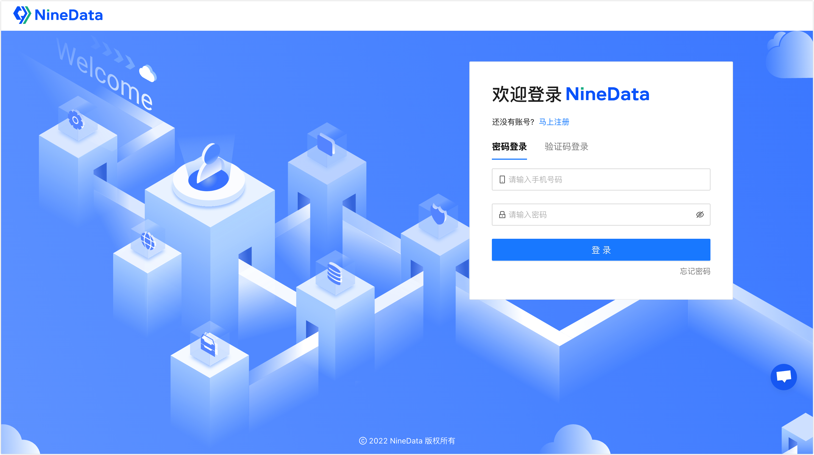

# 步骤二：登录 NineData

本文介绍如何登录 NineData。

### 操作步骤

1. 打开 [NineData 登录页面](https://console.ninedata.cloud)。

2. 您可以选择通过**密码登录**或**验证码登录**。

   **密码登录**：输入注册时使用的手机号码，并输入密码，单击**登录**。

   :::tip

   如果您忘记了登录密码，可以单击右下角的**忘记密码**进行**重置密码**。
   
   :::
   
   **验证码登录**：单击**验证码登录**，输入注册时使用的手机号码，单击**获取验证码**，并输入 NineData 系统发送的验证码，然后单击**登录**。

### 下一步

[申请免费数据源并生成测试数据](3_demo_datasource.md)
