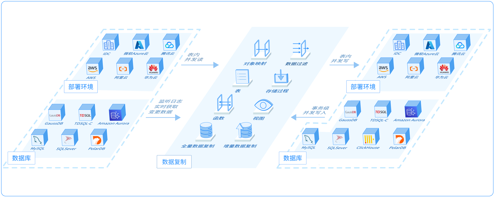

# 数据复制简介

NineData 数据复制支持多种同异构数据源之间的离线、实时数据复制。适合数据迁移、数据库扩缩容、数据库版本升级、异地容灾、异地多活、数据仓库及数据湖数据集成等多种业务场景。

### 产品架构

### 产品优势

NineData 数据复制产品基于云原生架构，相比于传统数据复制产品，无论是在安全、性能、成本等各个方面都具有巨大的优势。

* 简单易用：SaaS 模式，即开即用，无需繁杂的部署和配置。

* 高性能：结合日志实时抓取、智能分片、事务性并发及热点合并等众多核心技术，实现强劲复制性能，增量复制延迟低至秒级。
* 高可靠：全面的监控报警机制，内置任务异常检测、自我修复机制并提供可干预能力，提升任务可用性。增量复制、多版本元数据、任务异常无缝重启等机制保障了任务的可靠性。
* 强一致：业界创新的断点续传技术及事务一致性同步能力，有效保证复制数据一致性，配合 NineData 的数据对比功能，保障您的数据质量。

* 多云、多数据库：为企业提供在多云环境下的多种数据库的数据复制能力，也支持本地自建及云厂商数据库的数据复制；同时支持多种常见数据库，包括 MySQL、SQLServer 及 ClickHouse 等。

### 应用场景

* 数据库迁移：需要进行跨地域、跨云或者跨数据源的数据迁移，以及自建数据库上云等场景。

* 实时数据仓库同步：支持将多种数据源、多个环境的数据实时集成到统一的数据仓库进行分析。

* 跨云跨地域容灾：支持在业务中心和灾备中心之间持续同步数据， 如果主地域发生故障，您可以将用户请求切换到灾备地域，实现跨云、跨地域容灾。

* 异地多活：支持在多个地域的业务节点之间实现双向实时同步，保障全局数据的一致性。
  * 当任何一个单元出现故障时，只需将该单元的流量切换至其他单元，既可实现业务的秒级恢复，有效地保障了服务的高可用性。
  * 根据业务的某个维度将业务流量分流至各个业务单元。例如，按照用户所属区域划分各单元的流量，实现用户就近访问，降低网络延迟，提升用户体验。同时，各个业务单元分布在不同的地域，可以有效解决单地域的基础设施限制业务扩展的问题。

### 相关文档

[执行数据复制](data_replication.md)
