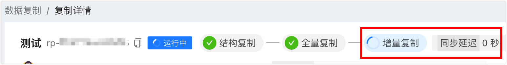
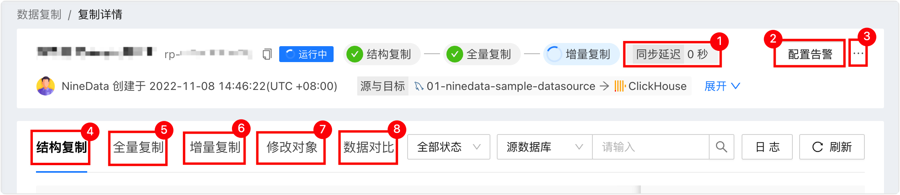

# MySQL 自建库复制到 ClickHouse

NineData 数据复制支持将自建 MySQL 的数据复制到 ClickHouse，支持全量复制和增量复制。

### 前提条件

- 已将源数据源和目标数据源添加至 NineData。如何添加，请参见[添加数据源](/configuration/datasource.md)。

- 源和目标数据源的版本见下表。

  | 源数据源                                                     | 目标数据源            |
  | ------------------------------------------------------------ | --------------------- |
  | <ul><li>MySQL 8.0</li><li>MySQL 5.7</li><li>MySQL 5.6</li></ul> | ClickHouse 20.8及以上 |

- 源数据源必须开启 Binlog，并且 Binlog 相关参数设置如下：

  - `binlog_format`=`ROW`
  - `binlog_row_image`=`FULL`

  :::tip
  
  如果源数据源为备库，为保证获取完整的 Binlog 日志，还需要开启 `log_slave_updates` 参数。
  
  :::

### 使用限制

* 执行数据同步前需评估源数据源和目标数据源的性能，同时建议业务低峰期执行数据同步。否则全量数据初始化时将占用源数据源和目标数据源一定的读写资源，导致数据库负载上升。
* 同步过程中，如果源数据源中包含视图（VIEW）、函数（FUNCTION）、存储过程（PROCEDURE）、触发器（TRIGGER）、事件（EVENT），则同步到目标数据源后，上述对象的定义者（DEFINER）信息将在目标数据源中被修改为当前同步任务中访问目标数据源的账号。
* 同步对象为表级别的情况下，同步过程中请勿使用在线 DDL 变更工具（例如：**gh-ost**、**pt-online-schema-change**）对源库的同步对象进行变更，否则会导致同步失败。
* 需要确保同步对象中的每张表都有主键或唯一约束、列名具有唯一性，否则可能会重复同步相同数据。
* 同步过程中，如果源数据源存在触发器，则系统会在增量同步结束以后才会同步触发器。

### 操作步骤

1. 登录 [NineData 控制台](https://console.ninedata.cloud)。

2. 在左侧导航栏单击**数据复制**。

3. 在**数据复制**页面，单击右上角的**创建数据复制**。

4. 在**数据源与目标**页签，按照下表进行配置，并单击**下一步**。

   | 参数

 | 说明                                                         |
   | -------------------------------------- | ------------------------------------------------------------ |
   | **任务名称**                           | 输入数据复制任务的名称，为了方便后续查找和管理，请尽量使用有意义的名称。最多支持 64 个字符。 |
   | **源数据源**                           | 同步对象所在的 MySQL 数据源。                                |
   | **目标数据源**                         | 接收同步对象的 ClickHouse 数据源。                           |
   | **复制类型**                           | <ul><li>**结构复制**：只同步源数据源的库表结构，不同步数据。</li><li> **全量复制**：同步源数据源的所有对象和数据，即全量数据复制。</li><li>**增量复制**：在全量同步完成后，基于元数据源的日志进行增量同步。</li></ul>**说明**：您还可以单击展开**高级设置**，选择存在同名表或相同数据时的处理策略。 |
   | **高级设置**                           | <ul><li>**结构冲突策略**<ul><li>**存在同名对象，则停止任务**：存在同名表时，停止同步任务。</li><li>**存在同名对象，忽略冲突并继续**：存在同名表时，检查结构是否一致，如果一致则忽略并继续同步任务，不一致则停止同步并通知用户。</li></ul></li><li>**数据冲突策略**<ul><li>**数据已存在，则停止任务**：存在相同数据时，停止同步任务。</li><li>**忽略数据冲突，继续任务**：存在相同数据时，忽略该条数据，继续同步其他数据。</li><li>**先删除，再重新写入**：删除该条数据，重新写入。</li></ul></li></ul> |

   

5. 在**选择复制对象**页签，确认需要复制的内容，您可以选择**所有对象**同步源库所有内容，也可以选择**自定义对象**，在**源对象**列表中选定需要同步的内容，单击**>**添加到右侧**目标对象**列表，然后单击**下一步**。

6. 在**配置映射对象**页签，配置源库和目标库，以及原表和目标表的映射关系，即配置同步到目标数据源之后的库名和表名，单击**保存并预检查**。

   :::tip

   您可以单击页面右侧的**映射与过滤**，自定义列名同步到目标数据源之后的名称。<!--除此之外，您还可以设置**数据过滤条件**，符合过滤条件的数据不会同步到目标数据源。-->

   :::

7. 在**预检查**页签，等待系统完成预检查，预检查通过后，单击**启动任务**。

   :::tip

   - 您可以勾选**开启数据一致性对比**。在同步任务完成后，自动开启基于源数据源的数据一致性对比，保证两端数据一致。根据您选择的**复制类型**，数据一致性对比的启动时机如下：

     - **结构复制**：结构复制完成后启动。

     - **结构复制+全量复制**：全量复制完成后启动。

     - **结构复制+全量复制+增量复制**：当增量数据首次和源数据源一致且**同步延迟**为 0 秒时启动。您可以单击**查看详情**，在**复制详情**页面中查看同步延迟。

       

   - 如果预检查未通过，需要单击目标检查项右侧**操作**列的**详情**，排查失败的原因，手动修复后单击**重新检查**重新执行预检查，直到通过。

   - **检查结果**为**警告**的检查项，可视具体情况修复或忽略。

8. 在**启动任务**页签，提示**启动成功**，同步任务开始运行。此时您可以进行如下操作：

   * 单击**查看详情**查看同步任务各个阶段的执行情况。
   * 单击**返回列表**可以返回**数据复制**列表。

### 查看同步结果

1. 登录 [NineData 控制台](https://console.ninedata.cloud)。

2. 在左侧导航栏单击**数据复制**。

3. 在**数据复制**页面单击目标同步任务的**任务 ID**，页面说明如下。

   
   
   | 序号

 | 功能

 | 介绍                                                         |
   | :------------------------------------: | -------------------------------------- | ------------------------------------------------------------ |
   |                   1                    | 同步延迟                               | 源数据源和目标数据源之间的数据同步延迟，0 秒表示两端之间没有延迟，此时您可以选择将业务切换到目标数据源，实现平滑迁移。 |
   |                   2                    | 配置告警                               | 配置告警后，系统会在任务失败时通过您选择的方式通知您。更多信息，请参见[运维监控简介](/alart/intro.md)。 |
   |                   3                    | 更多                                   | <ul><li>**暂停**：暂停任务，仅状态为**运行中**的任务可选。</li><li>**终止**：结束未完成或监听中（即增量同步中）的任务，终止任务后无法重启任务，请谨慎操作。如果同步对象中包含触发器，会弹出触发器复制选项，请按需选择。</li><li>**删除**：删除任务，任务删除后无法恢复，请谨慎操作。</li></ul> |
   |                   4                    | 结构复制（包含结构复制的场景下显示）   | 展示结构复制的进度和详细信息。<ul><li>单击页面右侧的**日志**：查看结构复制的执行日志。</li><li>单击页面右侧的**刷新**：查看最新的信息。</li><li>单击列表中目标表右侧**操作**列的**查看 DDL**：可以查看 SQL 回放。</li></ul> |
   |                   5                    | 全量复制（包含全量复制的场景下显示）   | 展示全量复制的进度和详细信息。<ul><li>单击页面右侧的**监控**：查看全量复制过程中的各监控指标。<!--全量复制过程中，还可以单击监控指标页面右侧的**限流设置**，限制每秒写入到目标数据源的速率。单位为行/秒。--></li><li>单击页面右侧的**日志**：查看全量复制的执行日志。</li><li>单击页面右侧的**刷新**：查看最新的信息。</li></ul> |
   |                   6                    | 增量复制（包含增量复制的场景下显示）   | 展示增量复制的各项监控指标。<ul><!--<li>单击页面右侧的**限流设置**：可以限制每秒写入到目标数据源的速率。单位为行/秒。</li>--><li>击页面右侧的**日志**：查看增量复制的执行日志。</li><li>单击页面右侧的**刷新**：查看最新的信息。</li></ul> |
   |                   7                    | 修改对象                               | 展示同步对象的修改记录。<ul><li>单击页面右侧的**修改同步对象**，可对同步对象进行配置，配置方式和[步骤 5](#step5)相同。</li><li>单击页面右侧的**刷新**：查看最新的信息。</li></ul> |
   |                   8                    | 数据对比                               | 展示源数据源和目标数据源之间数据对比的结果。包含**结构对比**和**数据对比**。<ul><li>单击页面右侧的**重新对比**：对当前源和目标两端数据重新发起对比。</li><li>单击页面右侧的**日志**：查看一致性对比的执行日志。</li><li>单击页面右侧的**监控**（仅数据对比显示）：查看对比 RPS（每秒对比的记录数）的走势图。单击**详情**可以查看更早之前的记录。</li><li>在对比列表右侧**操作**列单击：查看源端和目标端的表定义 DDL 语句对比详情。</li><li>在对比列表右侧**操作**列单击（不一致情况下显示)：生成变更 SQL，您可以直接复制该 SQL 到目标数据源执行，修改不一致的内容。</li></ul> |

### 相关文档

[数据复制简介](/replication/intro_repli.md)
