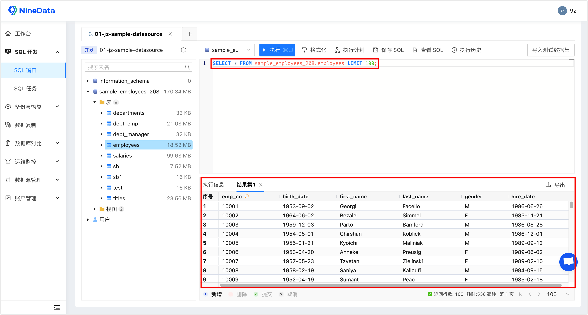

# SQL 窗口

本文介绍如何使用 SQL 窗口。

### 前提条件

已将目标需要管理的数据库添加到 NineData。如何添加，请参见[管理数据源](configuration/datasource.md)。

### 操作步骤

1. 登录 [NineData 控制台](https://console.ninedata.cloud)。

2. 在左侧导航栏单击 **SQL 开发**>**SQL 窗口**。
   
   :::tip
   
   如果之前登录过数据源且没有关闭，则会自动进入该数据源页面。
   
   :::
   
3. 单击**SQL 开发**下方文本框，会弹出您已添加的数据源，单击目标数据源，并单击**开始查询**，跳转到 SQL 窗口。

   :::tip

   如果有多个数据源，您可以在框中输入全部或部分关键词进行精确查找或模糊查找。支持搜索的字段如下：

   - 数据源名称

   - IP 地址

   

   :::

4. 打开 SQL 窗口后，即可对数据源执行 SQL 开发操作。如下图所示：
   SQL 窗口的详细使用方法，请参见[SQL 窗口功能介绍](#sql-窗口功能介绍)。

   :::tip

   如果目标数据源中添加了[敏感数据列](../configuration/sensitive.md)，您将无法完整查看敏感列的内容。如需查看，请先[申请敏感列权限](../account/manage_workflow.md#申请敏感数据权限)。

   :::

### SQL 窗口功能介绍

| 序号

 | 功能

 | 介绍                                                         |
| :------------------------------------: | -------------------------------------- | ------------------------------------------------------------ |
|                   1                    | SQL 窗口页签                            | 表示当前已打开的数据源 SQL 窗口，多个 SQL 窗口可以通过单击页签切换。 单击页签右侧的**X**可以关闭该 SQL 窗口。 |
|                   2                    | 打开数据源                             | 选择并打开新的数据源 SQL 窗口。                                |
|                   3                    | 数据源信息                             | 展示当前 SQL 窗口的数据源信息，包含环境、IP 地址以及端口号。    |
|                   4                    | 刷新                                   | 可刷新当前数据源中的数据。                                   |
|                   5                    | 数据库名称                             | 选中目标数据库以执行 SQL 操作。效果等同于`USE`语句。           |
|                   6                    | 功能按钮                               | <ul><li>**执行**：执行选中的 SQL 语句。</li><li>**格式化**：调整选中 SQL 语句的结构，增强可读性。</li><li>**执行计划**：查看选中 SQL 语句的执行计划。</li><li>**保存 SQL**：将当前 SQL 窗口中的所有 SQL 语句保存至 SQL 列表，方便下次使用。</li><li>**查看 SQL**：查看已保存的 SQL，您可以将目标 SQL **插入**至当前的 SQL 窗口中。同时可以**编辑**或**删除**目标 SQL。</li><li>**执行历史**：查看目标数据源的 SQL 的执行历史。您可以选择日期过滤出某个时间段的执行历史，也可以通过关键词（SQL 语句、数据库名称、错误提示）搜索执行历史。</li></ul> |
|                   7                    | 搜索表名                               | 可输入表名快速查找目标数据表。                               |
|                   8                    | 数据库列表                             | 显示当前数据源中所有的数据库和数据表。支持如下功能：<ul><li>**查看库详情**：右键单击目标库，单击**查看库详情**，即可打开**数据库详情**页面。您可以在这里查看目标库中所有的**数据表**、**触发器**、**视图**、**存储过程**、**函数**以及**事件**。</li><li>**查询表数据**：右键单击目标表，单击**查询表数据**，可自动查询该表中的数据，默认返回 100 行。</li><li>**查看表详情**：右键单击目标表，单击**查看表详情**，即可打开**数据表详情**页面。您可以在这里查看目标表中所有的**列名**、**索引**以及**触发器**。</li><li>**生成创建脚本**：右键单击目标库或表，单击**生成创建脚本**，即可生成创建的 SQL 语句。</li><li>**创建表**：右键单击目标库或表，单击**创建表**，可视化创建数据表。</li><li>**创建新查询**：右键单击目标库或表，单击**创建新查询**，可以打开新的 SQL 窗口页签。</li><li>**导出**：右键单击目标表，单击**导出**，支持以 SQL、CSV、JSON、XML 格式导出数据表。可导出范围为当前页或者全部数据（最多 10000 条）。</li><li>**查看用户列表**：右键单击数据库列表最下方的**用户**，单击**查看用户列表**，可查看当前数据源中所有的用户信息。</li><li>**刷新**：刷新当前数据源。</li></ul> |
|                   9                    | SQL 编辑器                              | 支持如下功能：<ul><li>SQL 执行：支持单个语句或批量执行。</li><li>中断执行：SQL 执行过程中可以单击**停止查询**中断 SQL 的执行。</li><li>语法高亮</li><li>关键字和元数据自动提示</li></ul> |
|                   10                   | 执行信息、结果集                       | 显示 SQL 的执行信息以及结果集。<ul><li>执行信息：包含执行时间、执行的 SQL 语句、执行状态、执行耗时等信息。</li><li>结果集：显示 SQL 的返回结果。同时，您可以在结果集中可视化地对数据库进行增删改操作，并且可以单击**导出**，以 SQL、CSV、JSON、XML 格式导出数据表。可导出范围为当前页或者全部数据（最多 10000 条）。</li></ul> |

### 常见问题

- 通过 SQL 窗口打开 MySQL 数据源时报错`The user specified as a definer (‘mysql.infoschema‘@‘localhost‘) does not exist`怎么办？

  答：在本地 MySQL 客户端中通过`root`账户创建`mysql.infoschema`用户并对其授权，命令如下：

  1. 创建：`mysql> CREATE USER 'mysql.infoschema'@'localhost' IDENTIFIED BY '<密码>';`

     :::tip

     示例：`mysql> CREATE USER 'mysql.infoschema'@'localhost' IDENTIFIED BY '12345';`

     :::

  2. 授权：`mysql> GRANT ALL PRIVILEGES ON *.* TO 'mysql.infoschema'@'localhost';`

