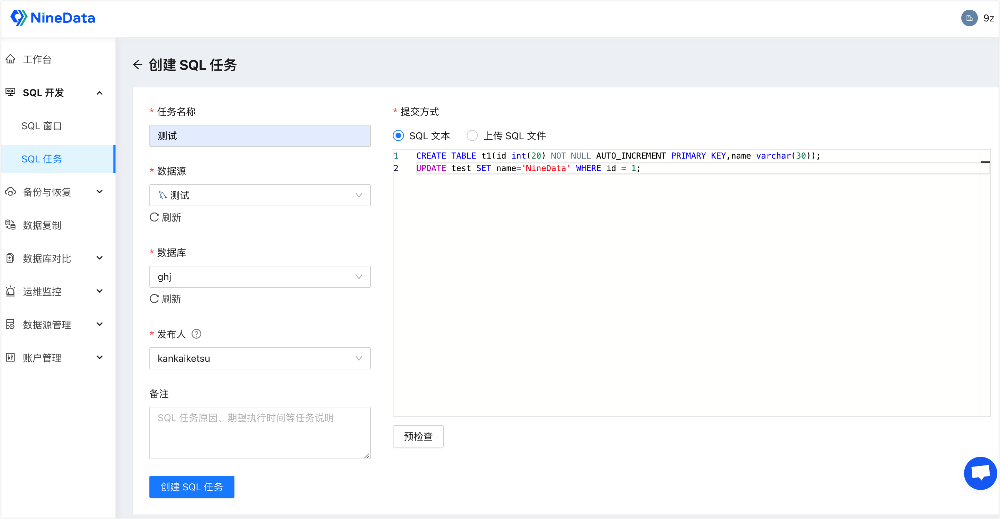
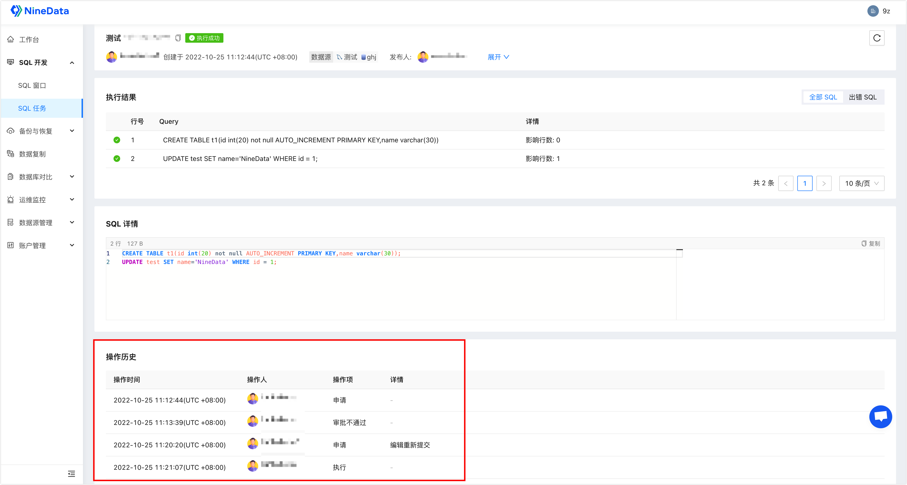

# SQL 任务

SQL 任务是对数据库发起 SQL 操作的任务，主要包括 DDL（数据库定义语言）、DML（数据库操纵语言）等 SQL 语句。本文介绍如何使用 SQL 任务。

### 功能介绍

为保障数据安全，对目标数据源没有写权限的用户无法对该数据源的内容发起变更，在有变更需求的情况下，可以通过提交 SQL 任务工单实现。NineData 提供的 SQL 任务功能具有全周期的安全管控，包括提交、审批、执行、回滚等步骤。

### 前提条件

* 已创建或加入组织。更多信息，请参见[管理组织](../account/manage_organization.md)。
* NineData 控制台处于组织模式。如何从个人模式切换组织模式，请参见[切换到组织](../account/manage_organization.md#切换到组织)。
* 当前用户具有访问 SQL 任务模块的权限。更多信息，请参见[预置角色权限列表](../account/manage_role.md#附录预置角色权限列表)。

### 提交 SQL 变更任务

1. 登录[NineData 控制台](https://console.ninedata.cloud)。

2. 在左侧导航栏，单击**SQL 开发**>**SQL 任务**。

   :::tip

   如果未找到**SQL 任务**，请确认您的控制台处于组织模式。如何从个人模式切换组织模式，请参见[切换到组织](../account/manage_organization.md#切换到组织)。

   :::

3. 在**SQL 任务**页面，单击右上角的**创建 SQL 任务**。

4. 在**创建 SQL 任务**页面，根据下表配置工单。

   

   | 参数

 | 说明                                                         |
   | -------------------------------------- | ------------------------------------------------------------ |
   | **任务名称**                           | 输入 SQL 任务的名称，该名称通常包含了 SQL 语句的执行目的，为减少沟通成本，请尽量使用有意义的名称。最多支持 64 个字符。 |
   | **数据源**                             | 目标需变更数据库所在的数据源。                               |
   | **数据库**                             | 需要执行 SQL 变更的数据库。                                  |
   | **发布人**                             | 当前 SQL 任务单的审批人兼审批通过后的 SQL 语句执行人。 **说明**：用户列表中仅显示对当前数据源拥有**审批与发布**权限的用户。权限相关信息，请参见[预置角色权限列表](../account/manage_role.md#附录预置角色权限列表)。 |
   | **备注**（可选）                       | 针对当前 SQL 任务未尽事项的说明，例如执行任务的原因，期望执行时间等。 |
   | **提交方式**                           | 输入需要执行的 SQL 语句或上传包含 SQL 语句的文件。<ul><li>**SQL 文本**：直接在文本框中输入需要执行的 SQL 语句。</li><li>**上传 SQL 文件**：单击**上传文件**，并选择包含需执行 SQL 语句的文件，单击**打开**。 **说明**：上传完成后，把鼠标移动到文件名处，可在文件名右侧选择（预览文件）或（删除文件)。</li></ul> |

5. 单击**预检查**，系统会提前对 SQL 语句进行检查，排除语法错误等无法执行的情况。如果 SQL 语句有问题，会在下方出现提示，单击提示中的**查看详情**即可查看具体的错误信息，方便您进行定位和修改。

6. **预检查**通过后，单击**创建 SQL 任务**，即可发起 SQL 任务。此时页面自动跳转至 **SQL 任务**页面，您可以查看 SQL 任务列表或对 SQL 任务进行管理操作。

   :::tip
   
   对于自身为**提交人**的任务，您还可以在 **SQL 任务**页面做如下操作：
   
   - **编辑**：如果任务被驳回（任务状态为**已驳回**），可以单击该任务右侧**操作**列的**编辑**，重新编辑SQL任务，并单击**重新提交**。
   - **转交**：单击该任务右侧**操作**列的>**转交**，更改该 SQL 任务的执行人。
   - **撤回**：撤回SQL任务。更多信息，请参见[撤回 SQL 任务](#撤回-SQL-任务)。
   - **复制任务**：单击该任务右侧**操作**列的>**复制任务**，复制一个一模一样的任务单。
   - **关闭**：单击该任务右侧**操作**列的>**关闭**，关闭目标任务单。关闭后，如果该 SQL 任务还未执行，则不会再被执行。
   - **删除**：如果任务状态为**已终止**，单击该任务右侧**操作**列的>**删除**，并输入任务名称，然后单击**删除任务**。
   
   :::

### 撤回 SQL 任务

SQL 任务的状态处于**待处理**时，您可以撤回该 SQL 任务的申请，撤回后，任务不再执行，您可以重新编辑该任务单再次提交。

**前提条件**

- SQL 任务的状态为**待处理**。
- 您是目标 SQL 任务的**提交人**。

**操作步骤**

1. 登录[NineData 控制台](https://console.ninedata.cloud)。

2. 在左侧导航栏，单击 **SQL 开发**>**SQL 任务**。

   :::tip

   如果未找到 **SQL 任务**，请确认您的控制台处于组织模式。如何从个人模式切换组织模式，请参见[切换到组织](../account/manage_organization.md#切换到组织)。

   :::

3. 在 **SQL 任务**页面，找到目标 SQL 任务，单击任务 ID 或任务右侧**操作**列的**详情**。在任务详情页右上角单击**撤回**。

   :::tip

   您也可以单击任务右侧**操作**列的>**撤回**。

   :::

4. 在弹出的确认窗口中，单击**撤回**或**撤回并编辑**。

   * **撤回**：页面自动跳转该 SQL 任务的详情页面，您可以单击页面右上角的**编辑**，或退回 **SQL 任务**列表找到该 SQL 任务，单击右侧**操作**列下的**编辑**，重新编辑任务单。
   * **撤回并编辑**：页面自动跳转至 SQL 任务的编辑页面。

### 审批 SQL 任务

**前提条件**

- SQL 任务的状态为**待处理**。
- 您是目标 SQL 任务的**发布人**。

**操作步骤**

1. 登录[NineData 控制台](https://console.ninedata.cloud)。

2. 在左侧导航栏，单击 **SQL 开发**>**SQL 任务**。

   :::tip

   如果未找到 **SQL 任务**，请确认您的控制台处于组织模式。如何从个人模式切换组织模式，请参见[切换到组织](../account/manage_organization.md#切换到组织)。

   :::

3. 在 **SQL 任务**页面，找到目标 SQL 任务，单击任务 ID 或任务右侧**操作**列的**详情**。

4. 在**任务详情**页面，审批 **SQL 详情**中的内容，根据实际情况选择**转交**、**执行**或**驳回**。

   | 

操作 | 说明                                                         |
   | -------------------------------------- | ------------------------------------------------------------ |
   | **转交**                               | 将任务单转交给其他用户审批。                                 |
   | **执行**                               | 批准申请，并根据业务需求选择**立即执行**、**定时执行**或**手动执行**。<ul><li>**立即执行**：马上执行 SQL 语句。</li><li>**定时执行**：选择一个时间执行 SQL 语句。<!--您可以选中**若执行失败，发送告警**，并选择**告警方式**和**接收人**，当 SQL 执行失败时，告警接收人会收到提醒信息。--> </li><li>**手动执行**：手动执行 SQL 任务单中的 SQL，并单击**已执行，标记成功**。您也可以单击**前往 SQL 窗口执行**手动执行该 SQL。</li></ul> |
   | **驳回**                               | 驳回请求，不执行该 SQL 任务。单击**驳回**后，您还需要输入**驳回原因**，并单击**确定**。 如果您批准了 SQL 任务，并选择了**定时执行**，则还可以在该任务状态为**待执行**的情况下驳回该 SQL 任务。操作步骤：<ol><li>在 **SQL 任务**页面，单击该任务右侧**操作**列下的**撤销执行**，或在该任务的详情页的右上角单击**撤销执行**。</li><li>输入**驳回原因**，单击**确定**。</li></ol> **说明**：**提交人**和**发布人**为同一人的情况下无法**驳回**，仅支持[撤回 SQL 任务](#撤回-sql-任务)。 |

5. 您可以在**任务详情**的**操作历史**中查看该工单的流程详情。

   
