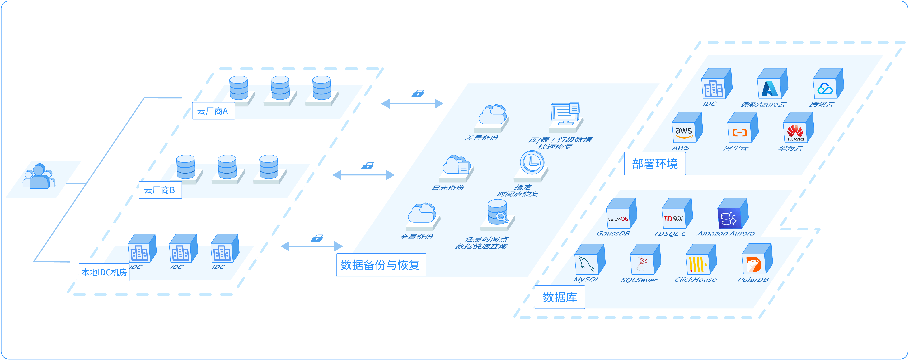

# 数据备份简介

数据备份是玖章云推出的基于云原生架构的数据备份恢复服务，支持多云及自建数据库等环境，轻松实现多环境间的容灾恢复、增量与全量数据备份等场景。

### 背景信息
数据安全是数字时代企业的命脉，是确保业务连续性、品牌声誉的基础。网络攻击、误操作等问题都会对数据安全构成重大威胁。

玖章数据备份服务是在深刻理解现代企业数据特点与数据保护需求的基础上推出的数据保护产品，通过充分利用云基础设施，为用户提供实时可用、持久在线、低成本的数据备份服务。

### 产品架构

### 功能介绍

<table>
  <tr>
  	<td><b>功能</b></td>
    <td><b>说明</b></td>
  </tr>
  <tr>
  	<td rowspan="2"><b>备份</b></td>
    <td><a href="./backup/logical_backup">逻辑备份</a>：以数据库对象（例如表、索引等）为备份对象的备份方式。支持全量备份、增量备份、结构备份等多种备份类型。</td>
  </tr>
  <tr>
    <td><a href="./backup/physical_backup">物理备份</a>：以数据库中的文件为备份对象的备份方式。</td>  
  </tr>
	<tr>
  	<td><b>恢复</b></td>
    <td>支持对<a href="./restore/restore_logical_backup">逻辑备份集</a>和<a href="./restore/restore_physical_backup">物理备份集</a>进行恢复。对于逻辑备份集，玖章云数据备份具备如下恢复能力：<ul>
      <li>秒级RPO：数据源节点发生故障后，可以将节点恢复到故障发生几秒前的数据状态，数据损失率为秒级。</li>
      <li>细粒度恢复：支持行级数据的快速恢复。</li>
      </ul>
    </td>
  </tr>
	<tr>
		<td><b>备份数据在线查询</b></td>
    <td>支持对逻辑备份集中的数据进行在线SQL查询。相关文档：<a href="backup_data_query">查询备份数据</a>。</td>
	</tr>
</table>

### 优势

玖章数据备份产品基于云原生架构，相比于传统备份产品，无论是在安全、性能、成本等各个方面都具有巨大的优势：
* **即开即用**：开通账号即可立即开始保护您的数据，按使用量计费，无其他成本。

* **简单易用**：使用界面简洁易懂，只需要简单的配置即可使用，无需了解更多的术语或学习新的技术，您可以将更多的时间和资源分配在更重要的业务上。

* **多环境支持**：支持多种环境下的数据库。包含公共云、专有云、混合云、自建数据库；支持公网或私网访问。

* **安全合规**：备份频率、备份周期、备份存储时长均可配置，支持异地备份及冷热备份。有效满足各种安全审计合规要求。同时，支持备份数据加密以及备份数据传输加密，有效保障数据的安全性。

* **高可用**：基于成熟云厂商提供的分布式高可用存储，可实现数据多副本冗余存储、跨地域（可用区）容灾。

* **秒级RPO**：通过实时监听及备份数据库变更日志，可实现接近秒级的RPO，最大程度保护业务数据的完整性。

* **备份数据实时查询**：基于自研的计算存储引擎，可实现任意时间点备份数据的快速查询。当业务库发生故障丢失数据时，可分钟级完成数据的查询及恢复。

### 典型使用场景
* **云端自建数据库备份**：出于成本或控制能力等原因，企业可能选择在云上自建数据库，玖章云数据备份服务可以提供实时备份能力，降低自建成本并提升数据保护能力。
* **本地数据库备份**：备份数据存储在本地，随着数据量的增加，可能会产生大量成本。您可以使用玖章云数据备份服务将本地数据库备份到云上，降低成本的同时享受高效率的备份体验。
* **备份到多云或多地域**：出于数据可靠性、安全合规的考虑，企业通常有备份数据异地存储或多云存储的业务诉求。玖章云数据备份支持适配多家云厂商，覆盖全球数十个存储地域，可以帮助用户快速构建跨地域、跨云的异地容灾。
* **分钟级快速恢复、应急恢复**：由于业务逻辑错误、客户操作失误等原因，导致部分数据需要回退到误操作之前的某个时间。通过备份数据在线查询功能，可以实现分钟级的备份数据恢复，将损失降到最低。
* **数据变更轨迹跟踪**：为了排查程序Bug或其他需求，需要找到某条数据的历史变化轨迹。通过备份数据在线查询可以轻松实现数据完整生命周期的回溯，及时消除风险。

### 相关文档

- [执行逻辑备份](backup/logical_backup.md)
- [执行物理备份](backup/physical_backup.md)
- [恢复逻辑备份数据](restore/restore_logical_backup.md)
- [恢复物理备份数据](restore/restore_physical_backup.md)
- [查看备份集](view_backup_sets.md)
- [查询备份数据](backup_data_query.md)

