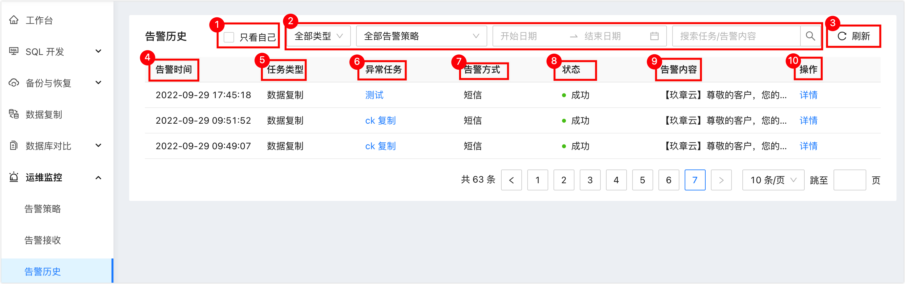

# 查看告警历史

NineData提供告警历史功能，告警被触发后会生成历史记录，您可以通过查看告警历史快速定位异常任务，提高故障复盘效率。

### 操作步骤

1. 登录[NineData控制台](https://console.9z.cloud)。

2. 在左侧导航栏单击**运维监控**>**告警历史**。界面说明如下：

   | 序号

 | 参数

 | 说明                                                         |
   | -------------------------------------- | -------------------------------------- | ------------------------------------------------------------ |
   | 1                                      | 只看自己                               | 可过滤接收方为当前账号的告警内容。                           |
   | 2                                      | 内容过滤选项                           | 可通过任务类型、告警策略、告警时间、关键词搜索等方式快速定位目标异常任务。 |
   | 3                                      | 刷新                                   | 刷新告警历史页面。                                           |
   | 4                                      | 告警时间                               | 告警的推送时间。                                             |
   | 5                                      | 任务类型                               | 告警对应的任务类型。                                         |
   | 6                                      | 异常任务                               | 触发告警的原任务名称。可单击任务名称直达该任务页面。         |
   | 7                                      | 告警方式                               | 告警的推送方式。                                             |
   | 8                                      | 状态                                   | 告警是否成功推送，如果推送的目标是一个组，则需要组内所有接收方全部收到告警才显示**成功**，否则显示**失败**。 |
   | 9                                      | 告警内容                               | 告警的详情，包含任务名称、失败原因等内容。                   |
   | 10                                     | 操作                                   | 可单击**详情**查看目标告警的详细情况。包含**基本信息**、**告警设置**、**告警内容**等。 |

   

### 相关文档

* [配置告警接收](alart_receiver.md)
* [配置告警策略](alart_rule.md)