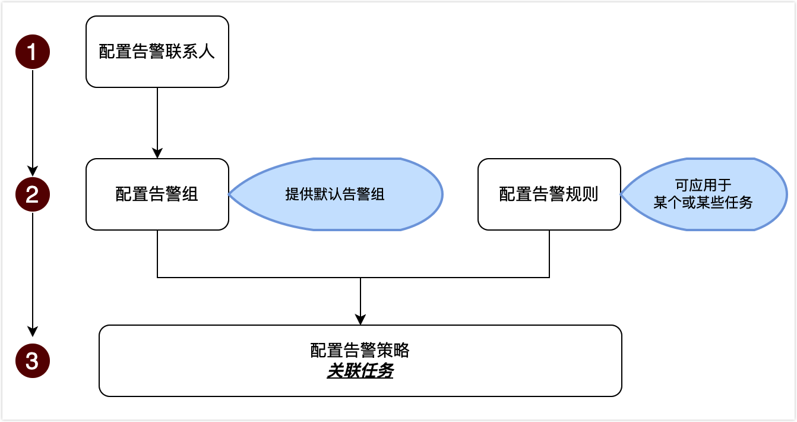

# 运维监控简介

NineData 提供运维监控功能，可实时监控 NineData 任务的运行状态，针对异常任务，支持通过告警的形式实时通知您，方便您及时采取措施。

### 背景信息

对于**数据对比**、**数据复制**、**数据备份**等异步运行且运行时间较长的任务，用户很难通过状态轮询的方式查看任务运行的情况。

为了提升使用体验，NineData 提供了监控告警功能，可随时随地监控任务的运行状态，并实时将异常信息通过短信、电话、邮箱、Webhook 等方式推送给您，大大降低任务维护成本。

### 功能介绍

| 项目

 | 说明                                                         |
| --------------------------------------- | ------------------------------------------------------------ |
| 支持的任务                              | 数据备份、数据恢复、数据复制、数据对比、结构对比、网关       |
| 监控指标                                | 数据备份：任务状态、全量备份时间、日志备份延迟 数据恢复：任务状态 数据复制：任务状态、复制延迟 数据对比：任务状态、对比时间、对比结果 结构对比：任务状态、对比时间、对比结果 网关：网关状态 |
| 告警规则                                | NineData 分别对每种任务类型提供了 1 条默认的告警规则，此类规则无法修改，您也可以根据业务需求创建自定义规则。更多信息，请参见[创建告警规则](alart_rule.md#创建告警规则)。 |
| 告警接收方                              | 支持将告警发送给个人，也支持发送给告警接收组内的所有成员，NineData 提供了一个默认的告警接收组 `默认告警组`，您也可以创建自定义的告警接收组。更多信息，请参见[配置告警接收](alart_receiver.md)。 |
| 告警渠道                                | 支持短信、电话、邮件、钉钉、飞书、企业微信。默认告警规则的告警渠道为短信，如需使用其他告警渠道，请手动[创建告警规则](alart_rule.md#创建告警规则)。 |
| 查看历史                                | 告警被触发后会生成历史记录，方便您后续进行任务的运维管理。   |

### 使用流程图

### 相关文档

* [配置告警接收](alart_receiver.md)
* [配置告警策略](alart_rule.md)
* [查看告警历史](alart_history.md)