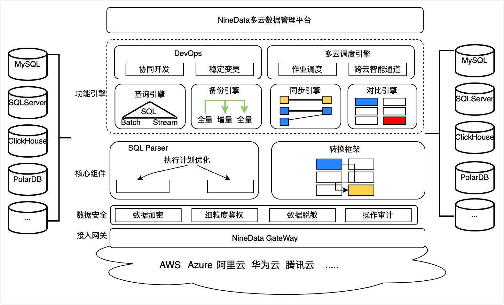

# Product Architecture

This chapter introduces the overall product architecture and core functional components of NineData.

### Architecture Description

NineData provides a distributed, easy-to-expand, highly reliable, multi-tenant product architecture. The product architecture diagram is as follows.

The entire product architecture is divided into five layers:

- **Access layer** : User interaction layer, which provides task creation, management, and operation and maintenance of data management. The service is mainly provided in the form of an interactive console.
- **Function engine layer** : responsible for specific data management work. Including DevOps, query engine, backup engine, synchronization engine, comparison engine and scheduling engine. For details on the capabilities of each engine, see [Engine Introduction](#functional-components) .
- **Core component layer** : public layer components, serving the upper-layer functional engine, providing log parsing, data conversion, and data storage engine capabilities.
- **Data security layer** : Provides data security protection capabilities covering the entire data life cycle and throughout the data management process. Components include fine-grained permission control, sensitive data management and desensitization, data encryption and security operation auditing.
- **Data source connection layer** : Responsible for providing connection access to multiple data sources for the upper engine.

### functional components

<table>
<thead>
  <tr>
    <th>Engines and Components</th>
    <th>illustrate</th>
  </tr>
</thead>
<tbody>
  <tr>
    <td rowspan="2"><b>DevOps and query engines</b></td>
    <td><b>DevOps</b> :<ul>
      <li>Verify that the SQL request has execute permission.</li>
      <li>Identify sensitive data and desensitize on the fly.</li>
      <li>Provides enterprise-level database collaborative change capabilities.</li>
      </ul>
    </td>
  </tr>
  <tr>
    <td><b>Query engine</b> : Receive SQL requests sent by users.</td>
  </tr>
  <tr>
    <td><b>scheduling engine</b></td>
    <td>Responsible for the overall task and resource scheduling of the platform.<ul>
      <li><b>Resource scheduling</b> : According to the cluster load pressure and node health, dynamically adjust the resource water level, and go online and offline for service nodes.</li>
      <li><b>Task scheduling</b> : According to the geographic location of the task data source, the quality of network access, and the resource load of each node, the task is scheduled to the most suitable node for execution. If the task is abnormal, the scheduling engine will automatically schedule the task to a healthy node to ensure the stable execution of the task.</li>
      </ul></td>
  </tr>
  <tr>
    <td><b>Backup engine</b></td>
    <td>Responsible for performing backup and recovery tasks, and regularly push task execution status, progress and exceptions.</td>
  </tr>
  <tr>
    <td><b>Sync engine</b></td>
    <td>Responsible for performing data replication tasks, and automatically schedule related dependent tasks in a pipeline manner according to the replication type configured by the user. At the same time, the task execution status, progress and abnormal conditions are regularly pushed.</td>
  </tr>
  <tr>
    <td><b>Compare engine</b></td>
    <td>Responsible for performing structure and data comparison tasks between two data sources, and regularly push task execution status, progress and exceptions.</td>
  </tr>
  <tr>
    <td><b>SQL Parser</b></td>
    <td>SQL parsing module. Responsible for the analysis of SQL statements and logs in the overall platform, and assist the engine to complete tasks such as data reading and data security access.</td>
  </tr>
  <tr>
    <td><b>Sensitive data management</b></td>
    <td>Responsible for providing sensitive data metadata and masking functions for the query engine, backup engine, synchronization engine, and comparison engine. Dozens of sensitive data recognition algorithms are built-in, and when enabled, the sensitive fields in the data source are automatically scanned and marked.</td>
  </tr>
</tbody>
</table>

