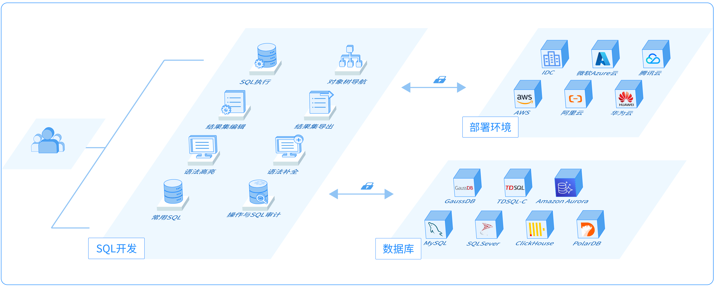
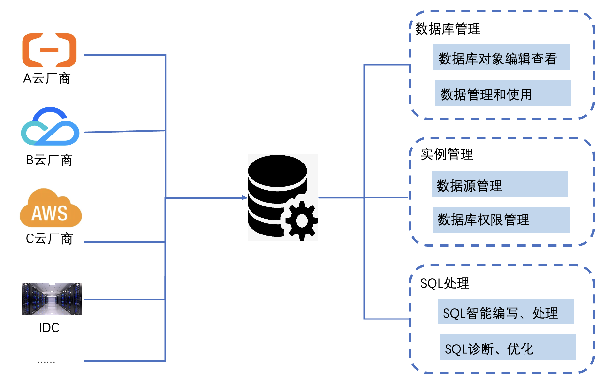
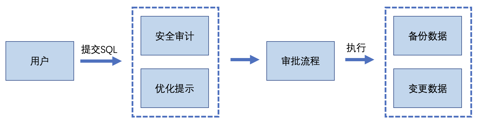

# SQL开发简介

玖章云的SQL开发是一套云原生SQL开发工具，支持在线查询与管理数据，支持多种数据库类型。

### 功能介绍

SQL开发具有数据资产管理、数据查询、SQL执行、数据编辑、数据导出等功能，具备强大的SQL编辑器，支持完整的语法高亮、自动补全、对象类型识别、错误提示等能力，帮助用户快速完成多种环境的数据管理任务，助力企业数字化转型。

### 架构图

### 产品优势

* 多数据源跨平台支持
  * 支持的数据源：Oracle、Postgres、SQL Server、MySQL、MongoDB、Redis、Clickhouse等。
  * 支持的环境：阿里云、AWS、华为云、腾讯云、移动云、自建数据库等。

* 数据安全使用

  默认使用TLS/SSL传输加密，防止数据泄露。完整的操作与查询审计日志，搭配子账号、角色和资源授权体系、工单流程、预检规则等功能，实现企业级的数据安全保障。

* 功能丰富操作简单

  零门槛的数据库管理服务，通过浏览器即可对数据库对象执行管理操作。支持语法补全、高亮、查询窗口自动保存与恢复、常用SQL保存等功能，帮助开发者高效、准确地完成SQL操作。

### 典型使用场景

* 统一数据库管理平台

  在日常业务系统研发中，需要访问与管理多种不同环境、不同类型的数据库，数据管理模块支持阿里云、腾讯云、华为云、AWS、Azure等多个云厂家的MySQL、SQL Server、ClickHouse等多种数据库产品。

* 安全数据库变更

  玖章云提供SQL安全审计，用户提交SQL数据变更后，对SQL语法进行安全审计，保证SQL输入的规范性和安全性。对于企业用户，通过工单管理，规范SQL变更、权限申请等流程，让企业的数据管理更安全更高效。

