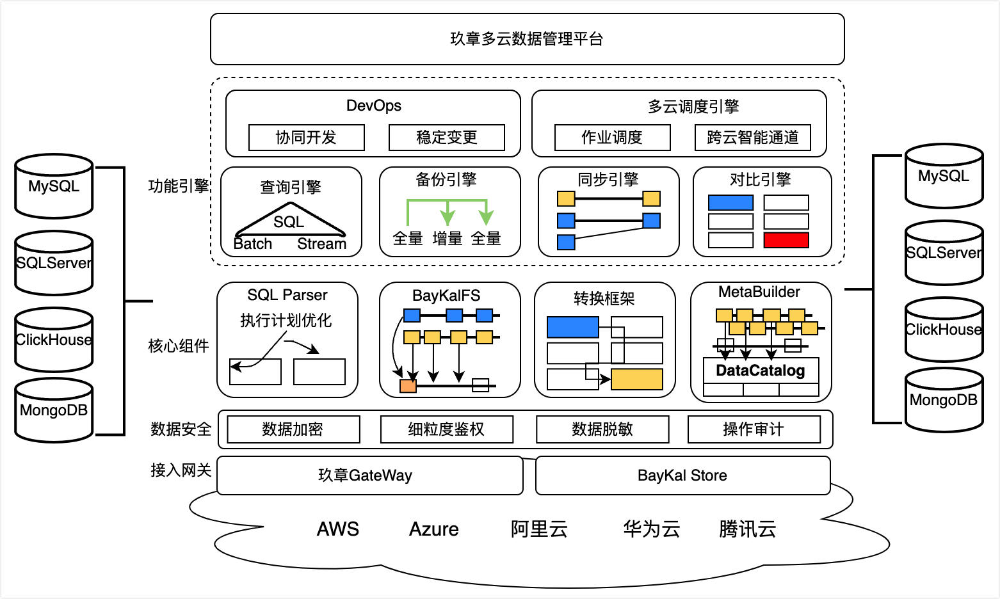

# 产品架构

本章介绍玖章云的整体产品架构、核心功能组件。

### 架构说明

玖章云提供了一套分布式、易扩展、高可靠、多租户的产品架构，产品架构图如下。

整个产品架构分为五层：

- **接入层**：用户交互层，提供数据管理的任务创建、管理及运维等。主要以交互式控制台的形式提供服务。
- **功能引擎层**：负责具体的数据管理工作。包含DevOps、查询引擎、备份引擎、同步引擎、对比引擎及调度引擎。各引擎的能力详情，请参见[引擎介绍](#jump)。

- **核心组件层**：公共层组件，服务于上层功能引擎，提供日志解析、数据转换、元数据中心及数据存储引擎等能力。

- **数据安全层**：提供覆盖数据全生命周期，贯穿数据管理过程的数据安全防护能力。组件包含细粒度权限管控、敏感数据管理及脱敏、数据加密及安全操作审计。

- **数据源连接层**：负责为上层引擎提供多种数据源的连接访问。

### 功能组件

<table>
  <tr>
    <td><b>引擎及组件</b></td>
    <td><b>说明</b></td>
  </tr>
  <tr>
    <td rowspan="2"><b>DevOps和查询引擎</b></td>
    <td><b>DevOps</b>：
      <ul>
        <li>校验SQL请求是否有执行权限。</li>
        <li>识别敏感数据并动态脱敏。</li>
        <li>提供企业级数据库协同变更能力。</li>
      </ul></td>
  </tr>
  <tr>
    <td><b>查询引擎</b>：接收用户下发的SQL请求。</td>
  </tr>
  <tr>
    <td><b>调度引擎</b></td>
    <td>负责平台整体的任务及资源调度。
      <ul>
        <li><b>资源调度</b>：根据集群负载压力及节点健康情况，动态调整资源水位，上下线服务节点。</li>
        <li><b>任务调度</b>：根据任务数据源所在的地理位置、网络访问质量及各个节点的资源负载情况等，将任务调度到最合适的节点上执行。如果任务出现异常，调度引擎会自动将任务调度至健康节点，保障任务稳定执行。</li>
      </ul>
    </td>
  </tr>
  <tr>
    <td><b>备份引擎</b></td>
    <td>负责执行备份恢复任务，并定期推送任务执行状态、进度及异常情况。</td>
  </tr>
  <tr>
    <td><b>同步引擎</b></td>
    <td>负责执行数据复制任务，根据用户配置的复制类型，以pipeline的方式自动调度相关依赖任务。同时定期推送任务执行状态、进度及异常情况。</td>
  </tr>
  <tr>
    <td><b>对比引擎</b></td>
    <td>负责执行两个数据源之间的结构、数据对比任务，并定期推送任务执行状态、进度及异常情况。</td>
  </tr>
  <tr>
    <td><b>SQL Parser</b></td>
    <td>SQL解析模块。负责整体平台中SQL语句、日志的解析工作，辅助引擎完成数据读取、数据安全访问等任务。</td>
  </tr>
  <tr>
    <td><b>MetaBuilder</b></td>
    <td>整个平台的元数据中心。负责构建并存储数据复制、数据备份的业务元数据。MetaBuilder支持提供多版本的元数据能力，实现数据源DDL变更后，数据复制DML及历史备份数据集查询的数据解析问题，保障任务的稳定性。</td>
  </tr>
  <tr>
    <td><b>敏感数据管理</b></td>
    <td>负责为查询引擎、备份引擎、同步引擎、对比引擎提供敏感数据元信息以及脱敏功能。内置数十种敏感数据识别算法，开启后自动扫描数据源中的敏感字段并打标。</td>
  </tr>
</table>

