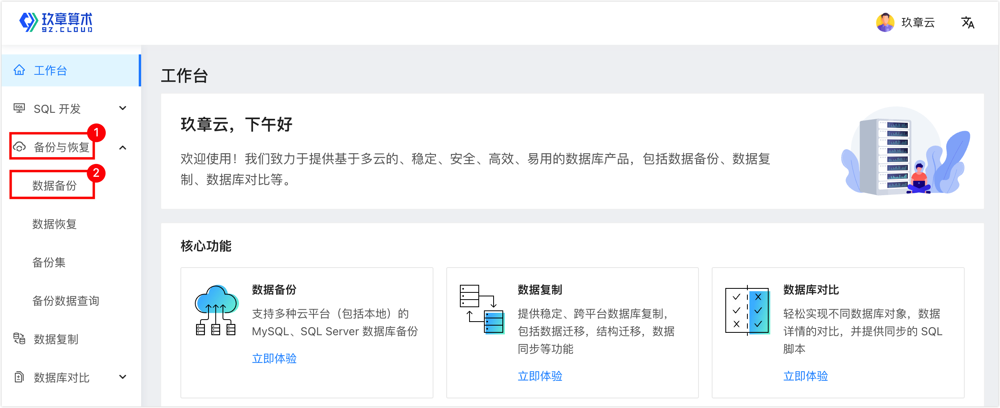
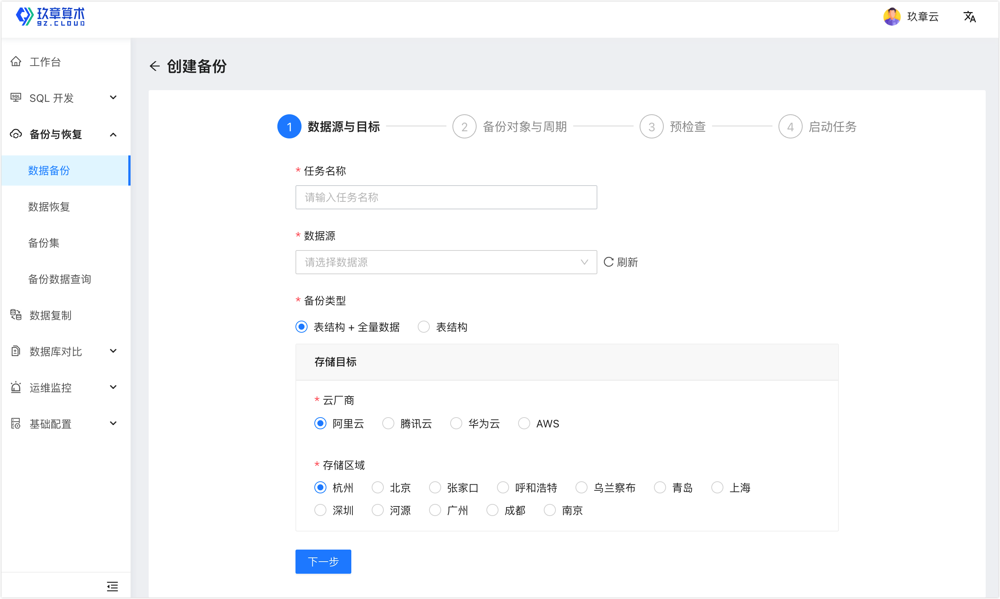
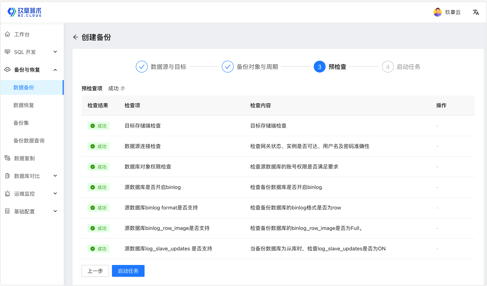
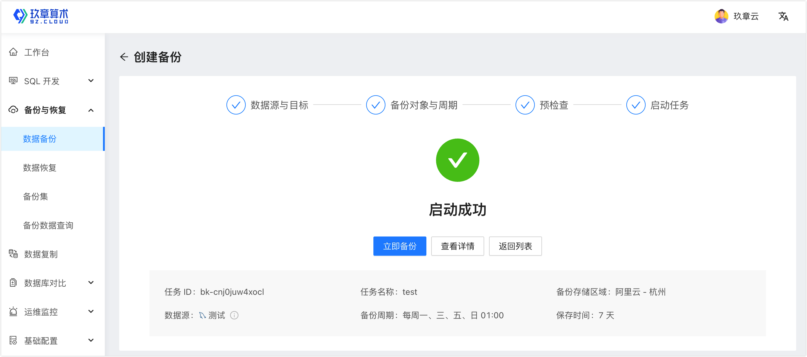

# 执行逻辑备份

玖章云数据备份服务的逻辑备份支持秒级RPO、行级数据恢复以及在线备份数据查询功能。本文介绍如何对数据库执行逻辑备份。

### 前提条件

- 已将数据源添加至玖章云。如何添加，请参见[添加数据源](../../configuration/datasource.md)。
- MySQL数据源的版本为8.0、5.7、5.6。
- SQL Server数据源的版本为2019、2017、2016、2014、2012、2008R2。

### 使用限制

当前仅MySQL支持全量和增量备份，SQL Server仅支持全量备份。

### 操作步骤

1. 登录[玖章云控制台](https://console.9z.cloud)。

2. 在左侧导航栏单击**备份与恢复**>**数据备份**。

3. 在**备份任务**页面，单击右上角的**创建备份**。

4. 在**数据源与目标**页面，按照下表进行配置，并单击**下一步**。

   | 参数

 | 说明                                                         |
   | -------------------------------------- | ------------------------------------------------------------ |
   | **任务名称**                           | 输入备份任务的名称，为了方便后续查找和管理，请尽量使用有意义的名称。最多支持64个字符。 |
   | **数据源**                             | 选择您希望进行备份的数据源，如果您刚添加了新的数据源，可以单击右侧的**刷新**获取最新的数据源列表。 |
   | **备份方式**（仅SQL Server支持）       | 选择**逻辑备份**。<ul><li>**逻辑备份**：以数据库对象（例如表、索引等）为备份对象的备份方式。支持全量备份、增量备份、结构备份等多种备份类型。</li><li>**物理备份**：以数据库中的文件为备份对象的备份方式。</li></ul> |
   | **备份类型**                           | 支持如下备份类型：<ul><li>**表结构+全量数据+日志数据**（仅MySQL支持）：备份数据中包含全量和增量数据。</li><li>**表结构+全量数据**：备份数据中包含全量数据。</li><li>**表结构**：仅备份表结构。</li></ul> |
   | **存储目标**                           | 选择备份数据的存储位置，请根据数据源所在位置就近选择。玖章云提供多个云厂商以及多个地域，支持**阿里云**、**腾讯云**、**华为云**和**AWS**，支持的地域请参见控制台。 |
   
5. 在**备份对象与周期**页面，按照下表进行配置，并单击**保存并预检查**。

   | 参数

 | 说明                                                         |
   | -------------------------------------- | ------------------------------------------------------------ |
   | **备份对象**                           | 需要备份的内容，支持全选和自定义。<ul><li>**所有数据库及对象**：备份该数据源中所有的数据库以及对象。</li><li>**自定义对象**：手动选择需要备份的数据库及对象。</li></ul>  |
   | **备份策略**                           | <ul><li>**备份频率**：选择多长时间备份一次，可选周一到周日、00:00到23:00的任意时间段。也可以勾选**全天**，每天备份一次。</li><li>**保存时间**：备份文件（包含备份文件和日志文件）的保存时长，到期后会被自动删除。可选时间为**7天、30天、60天、90天、半年、1年、2年**，默认为**7天**。</li></ul> |

6. 在**预检查**页面，系统会自动进行兼容性检查，检查结果会显示在页面上，全部成功后单击**启动任务**。

   > 如果检查未通过，您需要对未通过的检查项进行手动排查，完成后再重新根据此操作步骤配置备份任务。

7. 在**启动任务**页面提示**启动成功**后，数据备份服务会在您设定的备份周期自动启动备份。您也可以单击**立即备份**立即进行一次备份。

   > 如果您错过了该页面，也可以在左侧导航栏单击**数据备份**，并在**备份任务**页面单击该任务右侧**操作**列的**立即备份**来启动备份。

8. 在左侧导航栏单击**数据备份**，在**备份任务**页面单击目标**任务ID**，即可查看备份任务的详细状态。

### 相关文档

- [数据备份简介](../intro_back.md)
- [执行物理备份](physical_backup.md)
- [恢复逻辑备份数据](../restore/restore_logical_backup.md)
- [恢复物理备份数据](../restore/restore_physical_backup.md)
- [查看备份集](../view_backup_sets.md)
- [查询备份数据](../backup_data_query.md)
